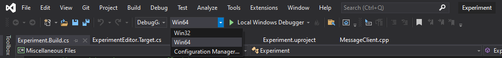
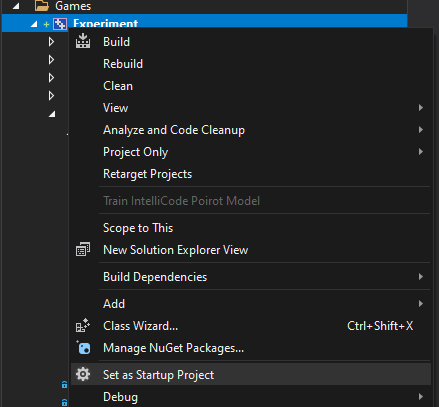

# MvP
Mouse Versus Predator

[Brief Description of the Project]

## Setup Guide
These are the steps you need to follow in order to run the Experiment in Unreal Engine

### Generating Project Files
1. Begin by cloning the [Experiments](https://github.com/germanespinosa/Experiment) Repo
2. Open up the containing folder and right-click on Experiment.uproject
3. You should see an option to "Generate Visual Studio Project Files"
   1. 
4. Once this completes, open up **Experiment.sln** in Visual Studio 

### Configuration Settings
Let's make sure we have the correct Configuration Settings, which will let us correctly 
build and compile the code so that we can edit the game!
1. At the top of the Visual Studio IDE, open up the Configuration Manager by click on the drop-down menu
next to the "Local Windows Debugger" play button
   1. 
2. Match your settings to the following:
   1. 
   2. Also, set **Experiment** as the Startup Project, you can do this by right-clicking on Experiment 
   in the solution explorer and navigating down to "Set as Startup Project"
   3. 
3. You should then be able to start Unreal Engine's Game Editor
