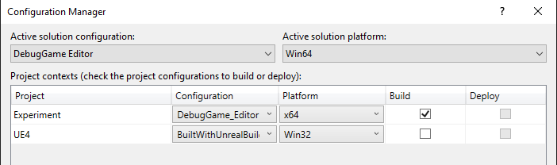
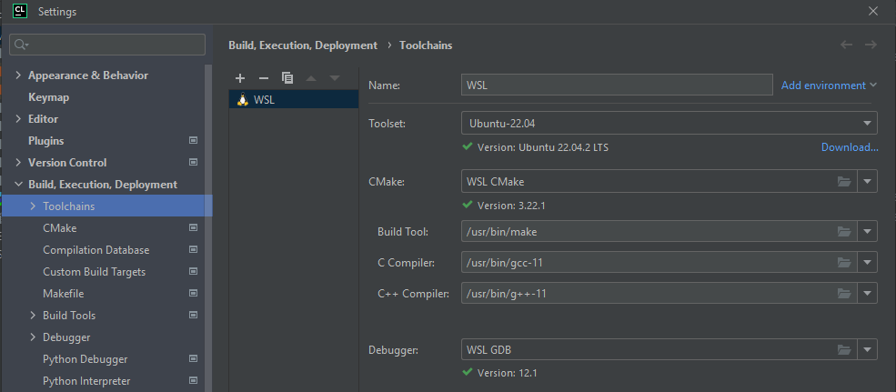

# MvP
Mouse Versus Predator

[Brief Description of the Project]

## Setup Guide
These are the steps you need to follow in order to run the Experiment in Unreal Engine

### Generating Project Files
1. Begin by cloning the [Experiments](https://github.com/germanespinosa/Experiment) Repo
2. Open up the containing folder and right-click on Experiment.uproject
3. You should see an option to "Generate Visual Studio Project Files"
   1. 
4. Once this completes, open up **Experiment.sln** in Visual Studio 

### Configuration Settings
Let's make sure we have the correct Configuration Settings, which will let us correctly 
build and compile the code so that we can edit the game!
1. At the top of the Visual Studio IDE, open up the Configuration Manager by click on the drop-down menu
next to the "Local Windows Debugger" play button
   1. 
2. Match your settings to the following:
   1. 
   2. Also, set **Experiment** as the Startup Project, you can do this by right-clicking on Experiment 
   in the solution explorer and navigating down to "Set as Startup Project"
   3. 
3. You should then be able to start Unreal Engine's Game Editor

### Port-Forwarding
1. Start by opening up `/mnt/c/Research/vr_service` in Windows Powershell 
2. Run the script `.\wsl-port-forwarding.ps1`
3. Now the ports should be forwarded

### Starting the Server
Before we can go ahead and actually play the game, we are going to need to start up the **vr server**,
which is a script that exists locally on the development computer. In fact a lot of what you need
exists locally under: `/mnt/c/Research/...`

1. Start by opening up `/mnt/c/Research/vr_service` in CLion
2. You may need to **Reload CMake Projects** or Rebuild it
3. Under **File -> Settings**
4. Under **Build, Execution, Deployment -> Toolchains**
5. 
6. ***It is Imperative that the WSL here is WSL2*** 
   1. To check your version, open up Windows Powershell and run `wsl -l -v`
   2. It should output: **Ubuntu-22.04 Version 2**
7. In the top right, you should now be able to run the script `vr_server`. 
8. 
9. At this point the vr_server 

### Adding in the Occlusions
In order to see occlusions in the VR World, you need to run an Experiment. This involves running a Python
script that describes specific locations of the occlusions. 
1. After starting the vr_server you can go to the same menu and this time run **start_experiment**
2. This will add in occlusions into the environment when you play

### Setting up a Static IP Address
In order to set up a Static IP Address, start by going to the Windows settings
1. Open up _Network & Internet_
2. Scroll down to _Ethernet or WiFi_, and open up the connected network. 
3. Go down to _IP Setting_, click _Edit_ then _Manual_ to create a Static IP
   1. Set the IP Address - This is something you come up with
   2. Subnet prefix length should be 24 (bits)
   3. Gateway is the same address as the default gateway (129.105.69.1 or 129.105.49.1)?

### Step-Up Module Bill of Materials
[Step-Up Module BoM](https://docs.google.com/spreadsheets/d/1b9FdkY2aQWLmUtxk2oAGR2HAnpVTHtHQpYreBFGOhEA/edit?usp=sharing)