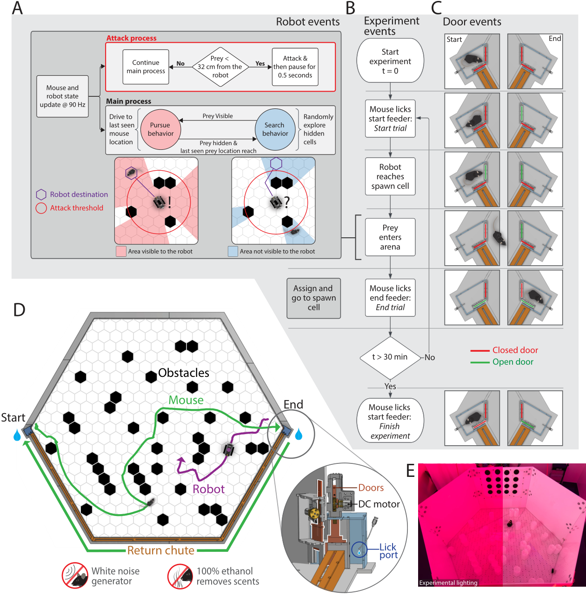
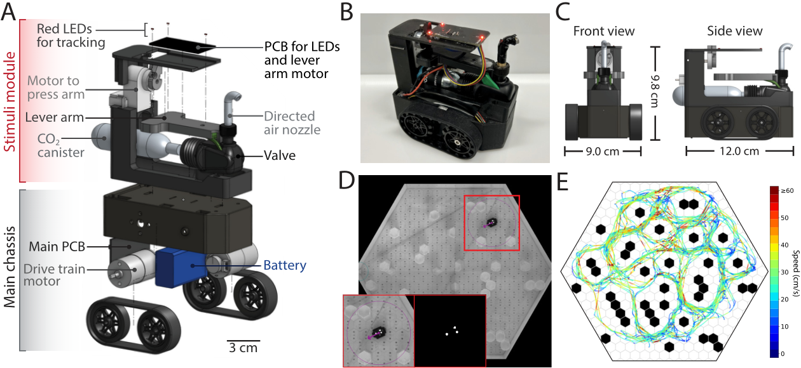
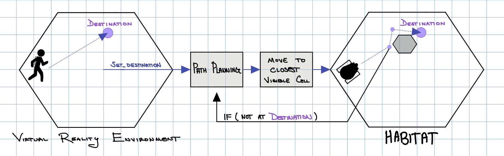
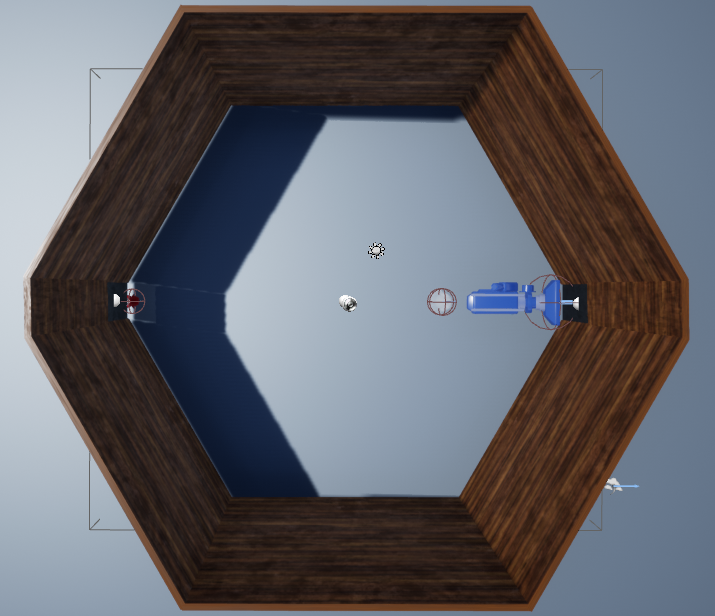
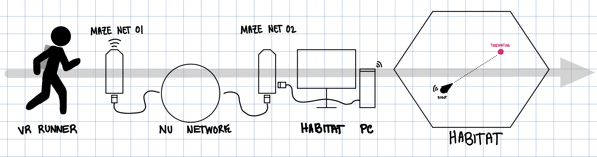
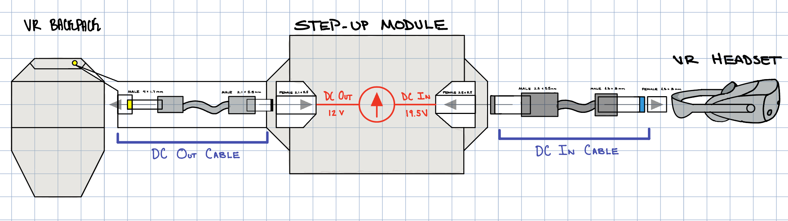
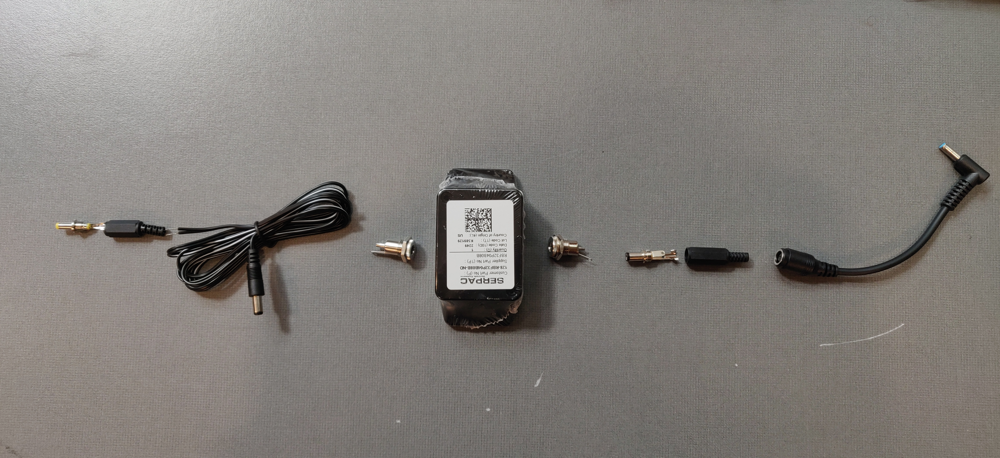
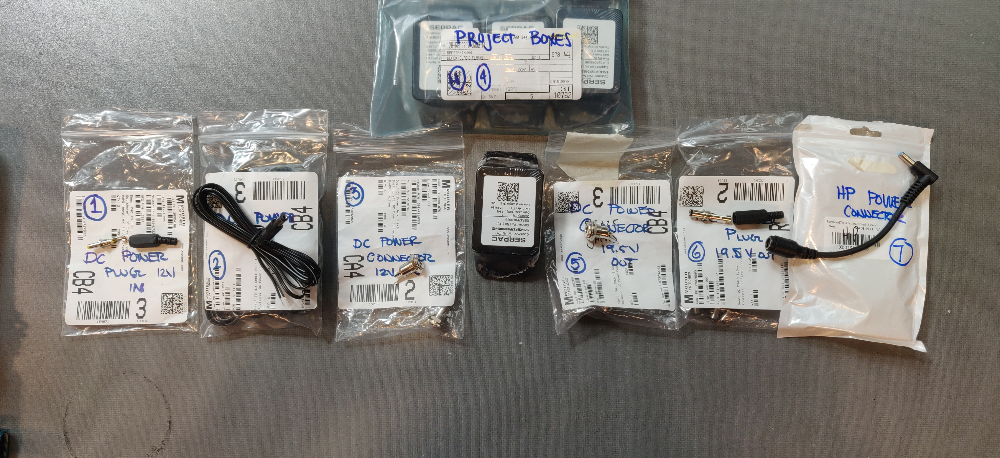
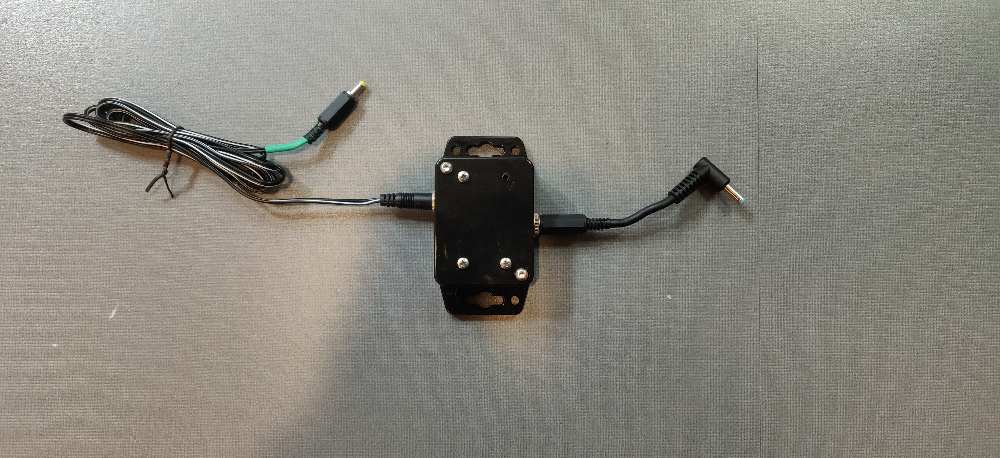

# MvP (Title WIP)

### Project Overview
[**It Controls a Robot in VR**]
The purpose of this project is to create a method of controlling a robot through virtual-reality. 

[**Planning Perspective**]
This is to understand the dynamic between predator and prey for the purpose of understanding planning.

[**Define Task That we Are Doing**]
We chase around a mouse by controlling the robot in a virtual-reality environment. Can talk about how this is actually less of a challenge than doing so with a game controller. 
<!--  -->

## Robotics Control

   

&nbsp

   
   <figcaption> The Skid Steer Drive Robot, designed by Gabrielle Wink and Dr. Angel Germán Espinosa Coarasa. Image Credits: Lai, et al. (2024). A robot-rodent interaction arena with adjustable spatial complexity for ethologically relevant behavioral studies. Cell Report

&nbsp

   
   <figcaption> [How Does the Robot Move to a Destination?]

  

[Explain How Giving a Set Destination Propogates into Giving Wheel Commands to a Skid Steer Drive Robot]

## Virtual-Reality

   
   <figcaption> Virtual Arena whooby dooby doo

&nbsp

   
   <figcaption> Despicts the area the real robot and mouse can move

&nbsp

[Okay so the readers know what the task is, how are we doing it in VR?]

[Making Arena Larger]

[Wilson Field Footage]

[How to Convert Coordinates in VR to Coordinates in the Habitat]

[Inputs to the Game]

[TODO: Adding in Occlusions]

[Anything else Relevant]

## Networking

[A break down of TCP Messaging, how it works and what I wrote using this Library (Credit Dr. Angel Germán Espinosa Coarasa)]

[Is essentially a custom package that lets us easily communicate between "nodes" in a client-server like relationship]

[Short Break Down of TCPTest and how that was used]

[TCP Messages allows up to send messages, requests and responses, broadcast messages to subscribed clients, etc.]

[Anything Else Relevant]

[Necessary IP Information]
[IP Address of the Habitat] Arena WAN: 129.105.249.94
[IP Address of the Habitat Computer]
Arena: Given IP: 192.168.137.73
Fixed IP: 192.168.137.151
 
[In order to allow Port Forwarding Script to Work]
Set-ExecutionPolicy -ExecutionPolicy Unrestricted

## Step-Up Module

**Overview:** The Step-Up Module is a *DC-to-DC converter that steps up 12V from the Virtual Reality (VR) backpack to 19.5V required by the VR Headset*. 
Because there isn't a proprietary cable that connects the HP Reverb G2 VR backpack to the HP Reverb G2 Headset, I made my own!

**Why?** Our Experiment requires a mobile agent moving in a large environment, which required us to extricate ourselves from a tethered power connection. This is because the Virtual Reality gear - the Headset and Backpack - requires a connection to an outlet..

**How it Works:** As mentioned previously, this DC-to-DC converter takes 12V from the VR backpack steps it up to 19.5V, and goes into the headset. This allows the backpack and headset to be completely untethered to a wall outlet.   

### Step-Up Module Bill of Materials
Here is the Bill of Materials as well as pictures depicting how the step-up module is assembled. Not depicted are the spacers and screws necessary, as well as the DC-DC step-up converter itself. 

Lastly is the fully assembled Step-Up Module

[Step-Up Module BoM](https://docs.google.com/spreadsheets/d/1b9FdkY2aQWLmUtxk2oAGR2HAnpVTHtHQpYreBFGOhEA/edit?usp=sharing)

#### Assembly of the Step-Up Module

#### Assembly with Numbered Parts

#### Fully Assembled Step-Up Module
